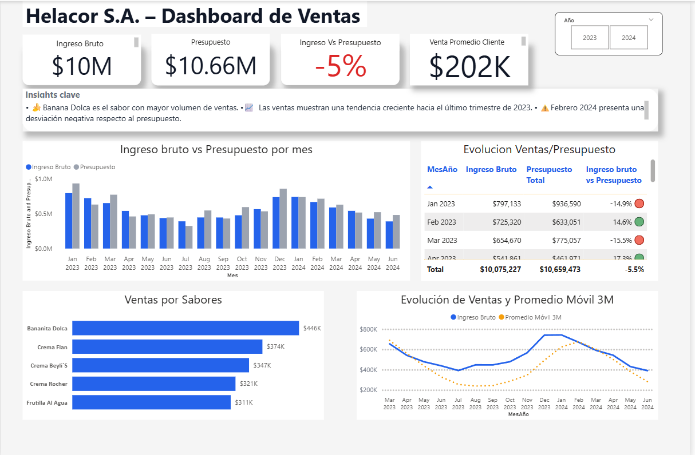
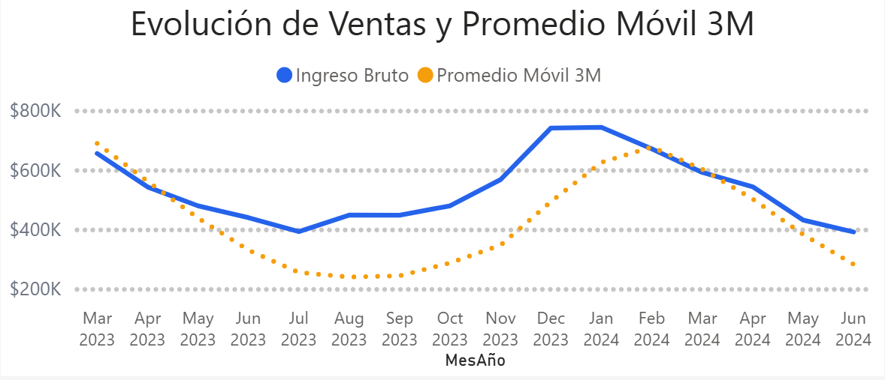
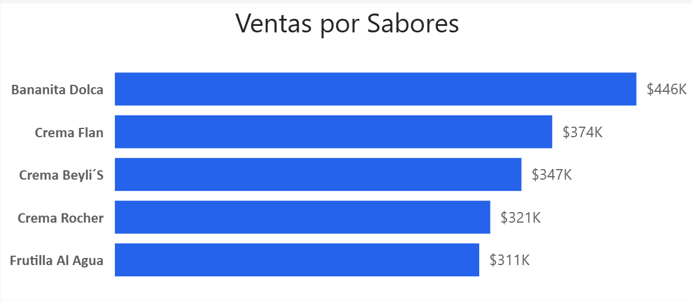

# Helacor SA - Sales Analytics Dashboard

## Project Overview

This project analyzes sales performance for **Helacor SA**, an ice cream company, using Power BI.

The objective of this analysis is to explore sales trends, product performance, and store-level performance to generate actionable business insights and support data-driven decision making.

The project includes data transformation, data modeling, KPI creation, and an interactive dashboard.

---

## Tools & Technologies

- Power BI
- Power Query
- DAX
- Microsoft Excel
- Data Modeling (Star Schema)

---

## Dataset

The dataset is stored in a single Excel file containing multiple sheets.

File:

helacor_sales_dataset.xlsx

Sheets included:

- **Sales** → transaction level sales data  
- **Products** → product information (category, name, etc.)  
- **Stores** → store details and locations  
- **Calendar** → date dimension used for time-based analysis  

The dataset simulates the operational sales data of an ice cream company.

---

## Data Preparation

Data preparation was performed using **Power Query**, including:

- Cleaning and formatting columns
- Standardizing data types
- Removing inconsistencies
- Preparing tables for modeling

---

## Data Model

The data model follows a **Star Schema**, a common structure used in Business Intelligence.

Fact Table:

- Sales

Dimension Tables:

- Products
- Stores
- Calendar

This structure allows efficient filtering and aggregation for analytical queries.

---

## Key Business Metrics

The dashboard tracks several KPIs relevant for sales analysis:

- Total Revenue
- Total Units Sold
- Average Ticket
- Sales by Product
- Sales by Store
- Monthly Sales Trend

These metrics help identify sales patterns and business opportunities.

---

## Dashboard Preview

### Sales Overview

### Sales Trend

### Product Performance

---

## Key Insights

Some insights identified during the analysis include:

- Sales show clear **seasonal patterns**, with higher demand during warmer periods.
- A small number of products generate a **large percentage of total revenue**.
- Monthly sales trends highlight periods of growth and potential opportunities for promotions.

---

## Repository Structure
